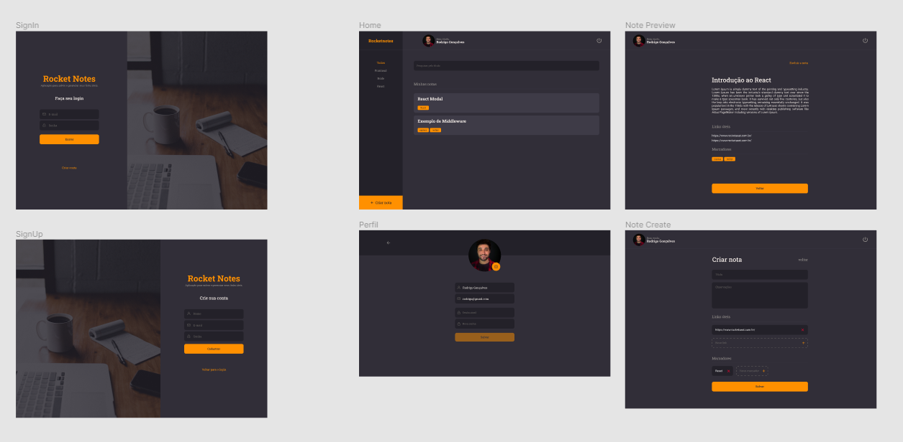

 
  

   
  

<!--  -->

<h2 align="center">Tecnologias 🚀</h2>
   

Esse projeto foi desenvolvido com as seguintes tecnologias:

- **React**
- **JavaScript (ES6 Modules)**
- **CSS-in-JS**
- **Vite**
- **Styled Components**
- **React Router**

  
  ---
  <h3 align="center">Projeto💻 </h3>
  
Acesse o projeto em <a href="https://rocket-notes-snowy.vercel.app/"> site🌐
  

